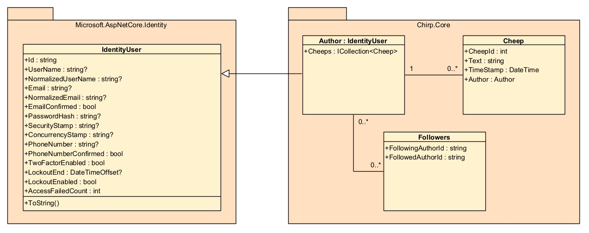
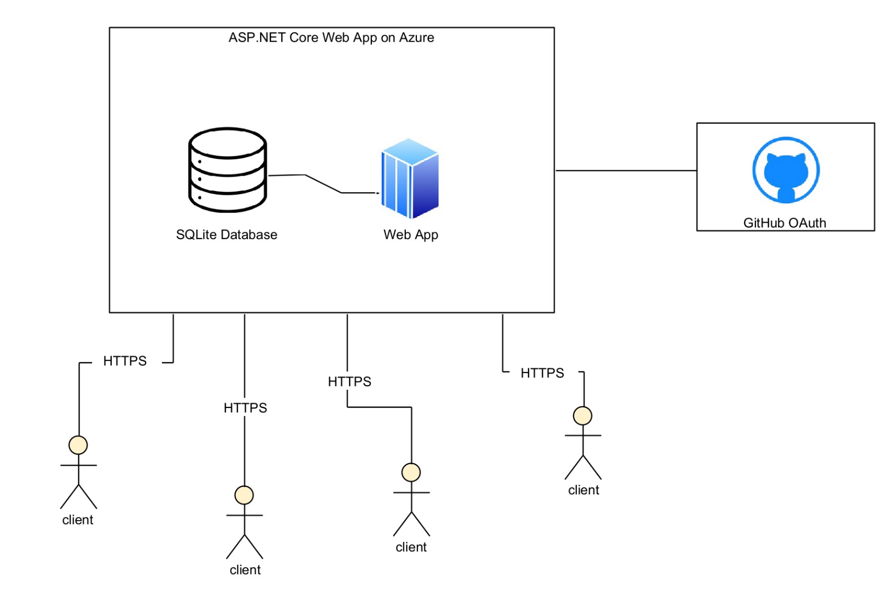
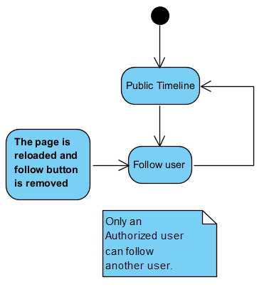
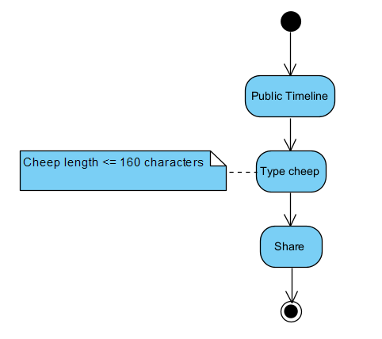
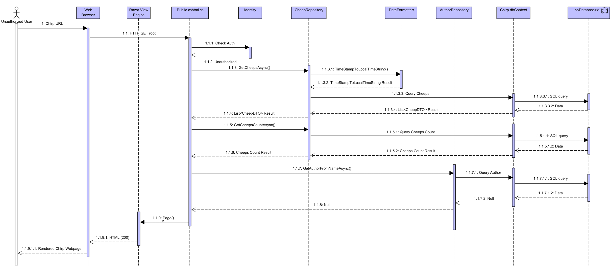
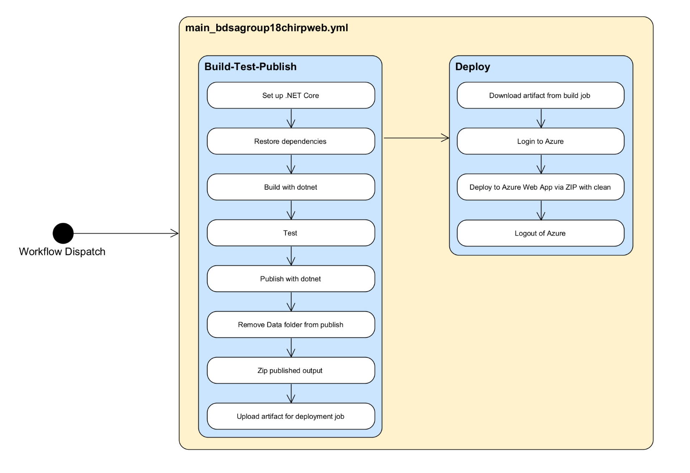

Analysis, Design and Software Architecture

BSANDSA1KU

https://github.com/ITU-BDSA2025-GROUP18/Chirp

# 1 Design and Architecture of Chirp!
## 1.1 Domain model

___Figure 1: Domain model illustration___

The domain model is quite simple. The 'Author' class is at the core, representing an Author -or user- in our system. Incorporating ASP.NET Core Identity, this class extends the 'IdentityUser' class, which provides standard user data- and behaviour such as username, email, phone number, as well as in-built password-hashing and more. Furthermore, extending this class acts a gateaway to further ASP.NET Core Identity features, including pre-made login and logout pages for the _Chirp!_ web app, two factor authentication, updating an Author's email and phone number, and more.

A Cheep is a message in our system, containing fields to store ID (CheepId), message content (Text), message timestamp (TimeStamp) as well as a reference to the author of the cheep (Author). 'Cheep' having this reference and 'Author' containing a list of Cheeps (Cheeps), effectively enforces a one-to-many relationship, where an Author may post many Cheeps and every Cheep only has one Author.

The 'Followers' class defines a many-to-many relationship, relating two Authors at a time, by referencing a 'following author' and 'followed author' by their respective IDs, enabling two Authors to follow each other.

This domain model effectively allows the _Chirp!_ web app system to contain users who may post messages and follow each other however they may wish.

## 1.2 Architecture — In the small

___Figure 2: Chirp! onion architecture___

The codebase is structured using Onion Architecture, where dependencies flow inwards toward the core.

The core layer, `Chirp.Core`, contains shared application logic, including DTOs (`AuthorDTO`, `CheepDTO`, `FollowerDTO`) and helper utilities such as `DateFormatter`. This layer is independent of frameworks and infrastructure.

The infrasturcture layer contains three subprojects: `Chirp.Services`, `Chirp.Repositories` and `Chirp.Database`.

* **Chirp.Database**: uses the DTOs as an in-memory store of the data loaded from the SQLite database (see section 1.3).
* **Chirp.Repositories**: uses the database context to query the database.
* **Chirp.Services**: works as an additional layer to modify/use the data loaded from a query.

The web layer (`Chirp.Web`) is the outermost layer and handles application startup, dependency injection, UI (Razor Pages), and migrations. It coordinates requests and delegates work to the underlying layers.

Finally, the test layer (`Chirp.Test`) contains unit, integration, UI and end-to-end tests targeting both core logic and web functionality.

The structure enforces dependency inversion making sure that each section only depends on the innermore layers.

## 1.3 Architecture of deployed application

___Figure 3: Chirp! server-client architecture___

Our server-side consists of an ASP.NET Core Web App Service and a SQLite database hosted on Microsoft Azure as a single-instance App Service.

The Application uses three main libraries: Razor pages, EF-Core & Identity-Core.

* **Razor pages**: is used as the view engine inside the Web app.
* **EF-Core**: is used to map the database tables to the classes and query the SQLite database using prepared statements.
* **Identity-Core**: is used to handle user authentication and our applications login and register functionality.

With the aid of these libraries, the server is responsible for managing data, handling authentication and executing application logic.

We chose SQLite for our database, since our web application only consists of a single app service instance and therefore has no need for replication or multiple-writer access. We also expected low traffic on the website, making SQLite the obvious choice for a simple and clean implementation of a database.

The server queries the database via DQLs (Database Query Language statements) and updates the database via DMLs (Database Modification Language statements), all initiated through the frontend. As illustrated on Fig. 3, clients connect to the frontend on their browser, which means that they have no access to the business logic running on the backend. The server sends generated HTML code to the client, and the client sends user interactions back to the server through HTTP requests. This includes actions such as posting cheeps, fetching cheeps, following users, authorization etc. An action that has been initiated is communicated through HTTP: POST and GET requests to the Razor Page handlers on the server, which handle the requests, possibly communicates with the database, and then sends an HTML response back to the client.

## 1.4 User activities
When accessing _Chirp!_ as an unauthorized user, the user is met with _Chirp!_ 's Public Timeline. As an unauthorized user there are limitations to what features are available. The user is able to look at the Public Timeline and read all current cheeps, however, they are unable to write cheeps themselves, and have no access to follow functionality and other features. The only features available for an unauthorized user are the register and login pages.

___Figure 4: Chirp! unauthorized user journey___

After a user has authenticated themselves on _Chirp!_, they gain access to multiple new features, these include:

* **Follow functionality**: The ability to follow other users.
* **Cheep sharing**: The ability to write cheeps on the public timeline.
* **My Timeline**: A private timeline of the users cheeps aswell as cheeps from followed users.
* **About me**: A page containing information about personal data, including all posted cheeps. Aswell as an option of deleting the user's account.
* **Account settings**: A page that allows changing account settings: **Phone Number**, **Email**, **Password**, seeing **External Logins** and **Two-factor Authentication**.
* **Logout**

___Figure 5: Chirp! authorized user journey___

### 1.4.1 Follow functionality
Below is a diagram that elaborates on the follow functionality of _Chirp!_. The follow feature is only availabe to authorized users and can only be seen by an authorized user.

___Figure 6: Chirp! follow functionality___

### 1.4.2 Cheep sharing
Below is a diagram that explains how authorized users are able to share cheeps on the Public Timeline. When typing a cheep, the length of the cheep can only be at most 160 characters. It is not possible to write more than 160 characters.

___Figure 7: Chirp! cheep sharing functionality___

### 1.4.3 About me
Below is a diagram that shows how an authorized user navigates the about me page. When a user doesnt want to have their data or account on Chirp any longer. They have the option to delete their account permanently from the webpage.

When deleting their account from our SQL Database, we use *hard deletes*. Meaning, the data from the user gets truly deleted and is impossible to recover. We chose this approach since it was easy to implement. If we had more complex features like, replys, video uploads, etc. A *soft delete* approach might have been better to presserve structure and avoid errors.[^1]

___Figure 8: Chirp! about me functionality___

## 1.5 Sequence of functionality/calls through Chirp!
Below is a UML Sequence Diagram of the functionality of _Chirp!_. The diagram starts with an HTTP request that is sent by an unauthorized user to the root endpoint of Chirp. It ends with the user seeing the fully rendered web-page returned.

___Figure 9: Chirp! Sequence of functionality UML diagram___

# 2 Process
## 2.1 Build, test, release, and deployment

___Figure 10: Chirp! CI/CD activity UML diagram___

As illustrated, there is a single GitHub Action workflow responsible for all CI/CD activity, namely `main_bdsagroup18chirpweb.yml`. The workflow file has two main jobs, with the second job dependending on the first job succeeding. The two jobs cover three main functionalities:

1. **Building (CI):**
When the workflow is manually triggered, it first builds the program. This process requires the environment setup to initiate, which entails installing the correct .NET 9.0 SDK on the runner, as well as restoring dependencies across the entire source code with `dotnet restore`.

    `dotnet build` is then used to build a 'Release' configuration of the web application, Chirp.Web, to ensure that the web app's source code builds succesfully.

    `dotnet build` is then furthermore used to build 'Debug' configurations of the projects containing tests, which will be used when tests are run soon after.

2. **Testing (CI)**
In order to have proper Continuous Integration, we must ensure all our code works as intended (or at least to the extent of our testing), by running our tests with `dotnet test`. From here, GitHub Actions continues our workflow ___if and only if___ all tests pass. That means that if a single test fails, the workflow-run is cancelled and the error-ridden code is never deployed, ultimately letting us keep our Azure web app live with good code, while stopping us when non functional code  may have been attempted to get deployed.

3. **Deployment (CD)**
Finally, now that the _Chirp!_ web app and tests have been built and the tests have passed, we create a publish-artifact of the `Chirp.Web` build with `dotnet publish`.

    From here, we remove the 'Data' folder -containing the database- from the publish artifact, such that the database on the Azure web app service is not overwritten. This is not an ideal persitent-database solution: say, for example, we wish to update the database schema with a new migration. In that case, we would first have to locally migrate the database, then adjust the workflow ___to___ overwrite, commit and PR the changes, have the PR accepted, run the workflow ___once___, then re-adjust the workflow ___back___ again to ___not overwrite___, and then again commit and PR the changes, and then finally have the ___new___ PR be accepted.

    This was realised late in development and deemed too big of a task to correct, especially given that this current solution _does_ technically keep our database persisent if we make no furhter migrations, which we won't, since that would exceed the scope of the _Chirp!_ project. As the /home directory in Azure App Service is preserved across deployments and application restarts, it provides a safe location for storing the SQLite database persistently and prevents data loss during redeployment. This would have been a better more optimized solution than our current one.

    With the publish ready and the database removed so the Azure-database does not get overwritten, we are ready to zip and upload the web app artifact as the final piece of the first job in the CI/CD workflow.

    The second job in the workflow, the 'Deploy' job, then downloads the zipped artifact from the 'Build' job, logs in to Azure and deploys the ZIP file, ensuring a full clean of the previous deployed code on the server. This prevents stale DLLs from causing issues with the new deployment. After the zipped, published artifact has been deployed, we logout of Azure and the CI/CD workflow is thus finished.

## 2.2 Team work
During the course of the development, we have only had a few open issues at a time, deeming the use of project boards unnecessary for us. Therefore, we cannot provide a screenshot of a project board.

One task that is still unresolved is a bug when registering on _Chirp!_ using GitHub. Some users who had their username private on GitHub, could not register as a user on _Chirp!_ and were met with an internal server error. Even if the username was public, the user would still be prompted to confirm their email. These are two bugs, that we have yet to resolve.

___Figure 11: Team work issue flow diagram___

As seen in Figure 11, the process of issues is as follows: First, an issue is identified. An issue can vary between either required features for our project, features we decided to include, subcomponents or errors we have encountered along the way. An issue contains acceptance criteria and a description of the issue along with how we want it addressed which will be written by the creator of the issue - acceptance criteria and a desciption being essential for an issue to be completed correctly.

Atleast one or more authors will be assigned to this issue depending on the workload and/or difficulty of the task.
The author(s) will handle the issue by frequently using trunk-based development, emphasizing continuous integration through small frequent commits. This approach ensures short-lived branches and minimizes merge-conflicts. This strategy reduces the likelihood of errors by relying on automated tests run before commits and ensures developers always work with the latest version of _Chirp!_.

Before the branch is merged, a pull-request is made by whom the issue is assigned to. The pull-request is not by any cause accepted right away. The pull request is checked by atleast one other member of the group depending on how much of the program the pull request will affect, handling conflicts, ensuring no errors, marking the issue as completed and finally merged into the main branch.

## 2.3 How to make Chirp! work locally
### How to run the program

Follow this step-by-step guide on how to run our program.
The first 3 steps will be pre-requirements to running the program.

##### Step 1. Clone the repository
First you need to clone or open the repository in your preferred code editor.

_Note: Make sure you are on the main branch_.

##### Step 2. Download .NET 9.0 SDK

If you currently do not have .NET 9.0 SDK installed, please refer to https://dotnet.microsoft.com/en-us/download/dotnet/9.0 and select the installer for your OS.

##### Step 3. Setting user-secrets
In order to enable GitHub authentication and authorization for _Chirp!_, you must to set GitHub OAuth user-secrets locally on your computer. Without the secrets, the app will not function so it is important to follow these steps:

1. Start off by visiting the [GitHub](https://github.com/) website.
2. Navigate to your profile settings by clicking your profile picture in the top right corner, and then 'Settings' in the drop-down menu.
3. In the left sidebar of the profile settings, scroll down and press 'Developer Settings'.
4. On the 'Developer Settings' page, press 'OAuth Apps' and then 'New OAuth App'.
5. Give the app a fitting name, write `https://localhost:5273/` as the Homepage URL and `https://localhost:5273/signin-github` as the Authorization callback URL, and press 'Register application'.
6. Once redirected to the application page, press 'Generate a new client secret'.
8. Finally, in a shell (fx. Command Prompt or PowerShell), navigate to the Chirp.Web project and run the commands

    `dotnet user-secrets set "authentication_github_clientId" <Client ID>` and

    `dotnet user-secrets set "authentication_github_clientSecret" <Client Secret>`,

    replacing \<Client ID\> and \<Client Secret\> with the values found on the application page.

This concludes setting user secrets.

##### Step 4. Run the program
Open a terminal window found in your code editor.

Navigate to the `Chirp.Web` folder.
If you are currently in the `Chirp` folder, you can run the following command to navigate to the `Chirp.Web` folder:

> cd ./src/Chirp.Web

Enter the following command:

> dotnet run

Proceed by clicking on the localhost link or copy-pasting the link into your webbrowser.

##### Step 5.
The _Chirp!_ application can be viewed and interacted with in two different states.

We will go through both states in the proceeding steps:

* Step 5.1 (signed out state)
* Step 5.2 (signed in state)

##### Step 5.1 Viewing and interacting with the the _Chirp!_ application without being signed in as a user.

You should now be able to see the _Chirp!_ application frontpage being the public timeline. Here all cheeps will be visible for visitors of the public timeline. Interacting by clicking on the username of one of the cheeps, you will be redirected to that user's timeline.

Besides viewing timelines you have access to two other tabs:

* Register (register as a user)
* Login (login as a user)

##### Step 5.2 Viewing and interacting with the the _Chirp!_ application being signed in as a user.

You will now have gained access to the following new features:

* Creating cheeps
* Following and being followed by other users
* Viewing and deletion of account data

And access to the following new sections:

* My timeline
* About me (information regarding your user)
    * Shows user information, your posted cheeps, followers and followed users.
    * "Forget Me!"-button for deletion of account and date.
* Account settings (edit account settings)
    * Update user- and login-information.
    * View or set external links and two-factor authentication

When you are done interacting with the _Chirp!_ application, proceed to the next step.

##### Step 6. Terminating the _Chirp!_ application.

Close _Chirp!_ by clicking (CTRL + C) on your keyboard while your code editor is the current application active on your screen.

If the above solution does not work for you. Instead, close the terminal tab currently running on your code editor.

## 2.4 How to run test suite locally
Follow this step-by-step guide on how to run test suite locally.

#### Prerequisites:
•	You need .NET 9.0 SDK installed.
•	The repository is assumed to already be cloned.

##### Step 1. Restore Build
Restore/build the solution

Open a terminal in the repository root folder and enter the following command:

> dotnet build

##### Step 2. Install Playwright
From the repository root directory:

> cd src/Chirp.Web/bin/Debug/net9.0

> pwsh playwright.ps1 install --with-deps
(only include 'pwsh' if PowerShell is not your current shell/terminal)

> cd ../../../../..

##### Step 3. Run test
To run the tests, it is required for the terminal to be located in one of the folders containing a .csproj file or .sln file.

Navigate to one of the following folders:

> cd . (root directory)

> cd ./test/Chirp.Core.Tests

> cd ./test/Chirp.Infrastructure.Tests/Chirp.Database.Tests

> cd ./test/Chirp.Infrastructure.Tests/Chirp.Repositories.Tests

> cd ./test/Chirp.Infrastructure.Tests/Chirp.Services.Tests

> cd ./test/Chirp.Web.Tests

After building, to run tests, enter the following command:

> dotnet test

Note: When you run `dotnet test`, .NET will build what’s   needed, executing tests, and reports which tests passed/failed.

##### Description of _Chirp!_ tests

To match onion architecture, tests are organized into separate test projects that target the corresponding layer. This also improves test discovery in IDEs and CI.

The following are our current test projects:

* `test/Chirp.Core.Tests` – tests for Core
* `test/Chirp.Infrastructure.Tests` – tests for Infrastructure
* `test/Chirp.Web.Tests` – optional web integration tests

Each test project is included in Chirp.sln and configured with standard test packages such as, `Microsoft.NET.Test.Sdk`, `xunit`, `xunit.runner.visualstudio`, `coverlet.collector` which helps IDEs discover tests correctly and makes `dotnet test` behave consistently.

Types of tests:

1. Unit / layer-focused tests
   These tests validate small pieces of behavior within a given layer, primarily Core and Infrastructure, because those layers contain reusable logic and persistence behavior.

2. Web integration tests
   Web integration tests validate that multiple parts work together through HTTP. They typically use:

    * `WebApplicationFactory<Program>` to boot the app in a test host
    * HttpClient to send requests like a real browser/client

    They usually cover Routing and endpoints, Controllers/handlers interacting with services/repositories, Views/HTML rendering, Middleware and the HTTP pipeline.

3. End-to-end tests
    End-to-end tests test the system more holistically by simulating running the application. Tests interact with the simulated web app, testing and expecting different behaviours in different scenarios.

4. UI tests
    UI tests test the frontend of the program, again simulating the web app, but this time interacting with the visual HTML elements on the page, expecting certain outcomes from certain simulated user behaviours.

During development we hit a failing web test due to GitHub OAuth configuration. These are the so called "web smoke tests". The app validates OAuth options at startup and requires a ClientId/ClientSecret.
These are typically not available in CI which can make an otherwise simple “home page” test fail with server errors. Because of this, OAuth-dependent tests were removed to keep the automated test suite stable.

# 3 Ethics
## 3.1 License
We are using the Apache-2.0 license, which allows the user a lot of flexibility with our project as long as we as developers are creditted for our work.

This license allows the user to copy, modify, sublicense and share our code to any kind of personal or commercial use. This is limited to that of the user has to include a copy of our original license and state any significant modifications done to our code.

We compared both the MIT-License and the Apache-2.0 license and decided to go with Apache-2.0.
The decision came to we not only want to ensure users the flexibility possible with both MIT and Apache-2.0, but also want to protect the users if we later on own any patents covering a part of the code used in _Chirp!_.
Apache-2.0 therefore also ensures that we protect each other in case some might continue development or use some parts of the project after the course.

## 3.2 LLMs, ChatGPT, CoPilot, and others

ChatGPT & Claude were used during the development of our project.

ChatGPT has been used as a sparring partner for some of us when we were researching for how to better understand certain elements that we had to include or create in our project, but through previous experience with ChatGPT, we are very skeptical of the responses that ChatGPT can give. The LLM can be helpful to further understand elements for our project, but is not fault-free and can give incorrect replies. This results in that ChatGPT is not a tool for writing code, but rather a tool for researching or when encountering errors and needing a sparring partner to better understand what went wrong.

Claude in another case was used to understand errors which we couldn't figure out among ourselves. Therefore, we resolved to researching through the web and asking Claude. Claude would help us understand errors and how to implement certain elements of our code without encountering the same errors again, but as many other LLMs, Claude is not fault-free and our goal with Claude was never for it to write our code, but to use as a guiding-tool to understand errors when we needed advice for implementing certain elements and prevent errors in program.

Overall LLMs were helpful in some sense, but sometimes it probably would have been better and faster, to simply ask a teaching assistant or professor for guidance.

# 4 Appendix

[^1]: https://www.geeksforgeeks.org/dbms/difference-between-soft-delete-and-hard-delete/ last accessed: 12/30/2025
